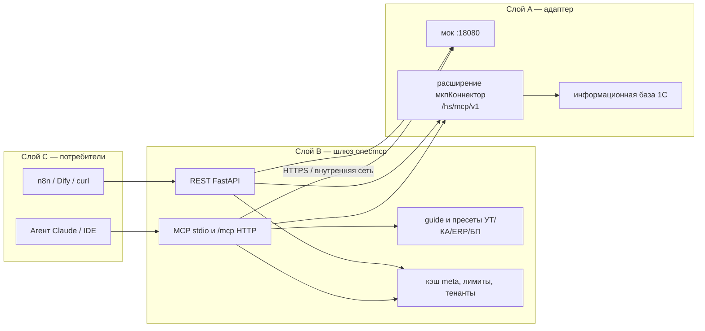
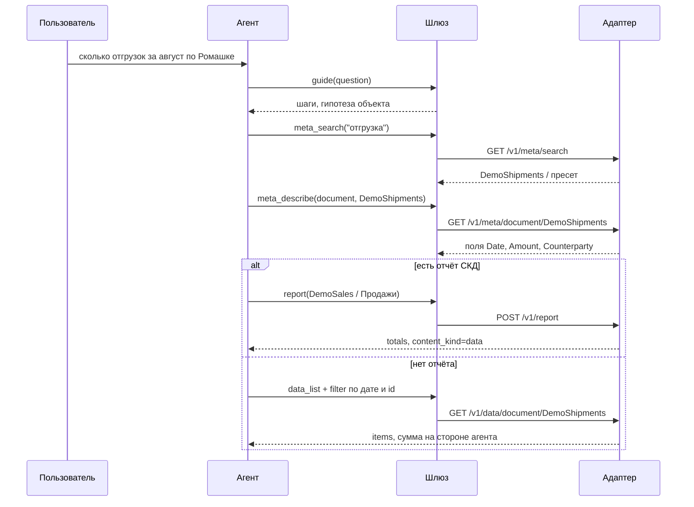
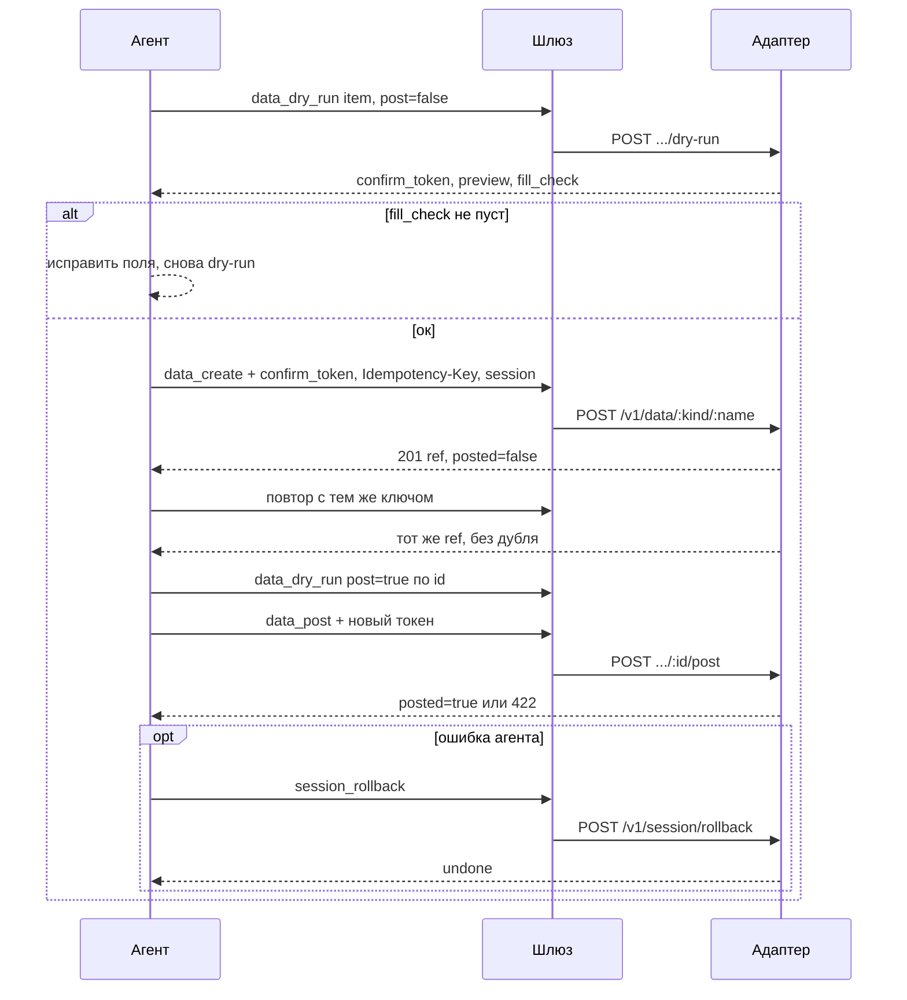
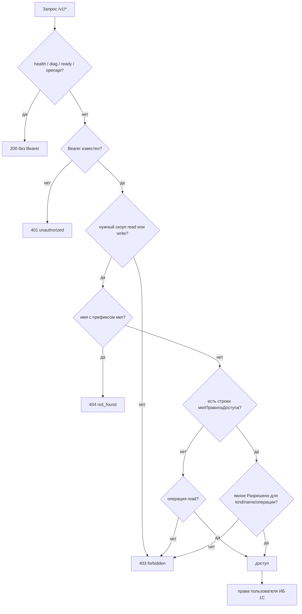
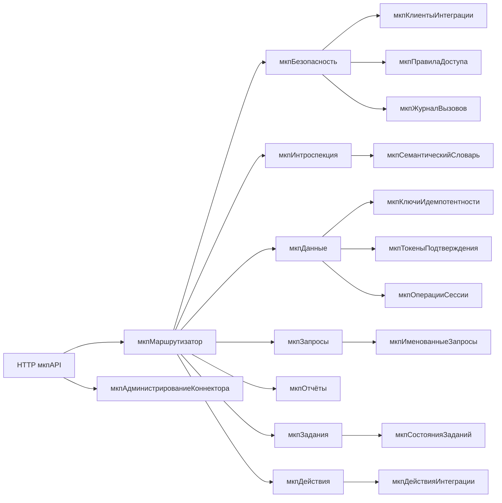

# 1cmcp — универсальный MCP/API-коннектор к базам 1С

Разработчик: **Стас Чашин**, [Stas@Chashin.pro](mailto:Stas@Chashin.pro)

Адаптер, открывающий любую конфигурацию 1С — типовую или самописную — для ИИ-агентов
и внешних приложений по протоколам MCP и REST: чтение данных, запись объектов,
запуск отчётов СКД и вызов бизнес-логики под контролем прав и аудита.

## С чего начать

| Документ | Для кого |
|---|---|
| **Сайт документации** (`mkdocs serve`) | все: вкладки Начало / Установка / Пользование / Администрирование / Справочник |
| **[Все настройки](docs/reference/settings.md)** | ни одна переменная и ни один реквизит вне этой страницы |
| **[Клиенты и лимиты суммы](docs/admin/clients.md)** | администратор 1С: токены, `ЛимитСуммы`, `ЛимитКоличества` |
| **[Установка](docs/install.md)** | внедренец, DevOps: мок, расширение, публикация, шлюз, Docker |
| **[Пользование](docs/usage.md)** | аналитик, автор сценариев: REST, MCP, запись |
| **[Пресеты и навыки](docs/skills.md)** | `guide`, словари типовых УТ/КА/ERP/БП |
| **[Совместимость](docs/compatibility.md)** | платформа 8.3.20+, режимы ИБ |
| [Чек-лист приёмки](docs/acceptance-checklist.md) | ревью |
| **[Пилот](docs/pilots.md)** | партнёрский инженер |
| [`docs/connect/`](docs/connect/README.md) | Claude Desktop, Cursor, n8n |
| [`specs/openapi.yaml`](specs/openapi.yaml) | контракт HTTP API v1 |

Короткая проверка без базы 1С — раздел ниже. Полный контур с Конфигуратором, ролями и токенами — только в [установке](docs/install.md).

## Архитектура

| Слой | Что это | Где живёт |
|---|---|---|
| **A** | Адаптер конфигурации: HTTP-сервис, интроспекция метаданных, права, журнал | Расширение `.cfe` внутри 1С (`extension/src`) |
| **B** | Протокольный шлюз: MCP + OpenAPI 3.1, кэш метаданных, аутентификация, лимиты | Python / FastAPI (`gateway/`) |
| **C** | Потребители: Claude, PIX Operator, n8n, Dify, внутренние сервисы | Снаружи |

Между A и B — только HTTPS с mTLS или VPN. Прямая публикация 1С наружу не предусмотрена.

### Слои и доверие



Снаружи виден только слой B (или stdio MCP на рабочей станции). Слой A в интернет не публикуется.

### Карта функционала

Слева — MCP-инструмент, справа — HTTP. Один контракт v1.

```mermaid
flowchart TB
  subgraph disc["Discovery"]
    H["health"]
    Dg["diag"]
    G["guide — MCP и GET /guide"]
    ML["meta_list"]
    MS["meta_search"]
    MD["meta_describe"]
  end
  subgraph read["Чтение"]
    DL["data_list"]
    DG["data_get"]
  end
  subgraph qrep["Отчёты и запросы"]
    R["report"]
    Q["query"]
    J["job_get"]
  end
  subgraph wr["Запись"]
    DR["data_dry_run"]
    DC["data_create"]
    DP["data_patch"]
    DPost["data_post"]
    Act["action"]
    RB["session_rollback"]
  end
  H --- GETH["GET /v1/health"]
  Dg --- GETDG["GET /v1/diag и /diag"]
  ML --- GETM["GET /v1/meta"]
  MS --- GETS["GET /v1/meta/search"]
  MD --- GETD["GET /v1/meta/:kind/:name"]
  DL --- GETL["GET /v1/data/:kind/:name"]
  DG --- GETI["GET /v1/data/:kind/:name/:id"]
  R --- POSTR["POST /v1/report"]
  Q --- POSTQ["POST /v1/query"]
  J --- GETJ["GET /v1/job/:id"]
  DR --- POSTDR["POST .../dry-run"]
  DC --- POSTC["POST /v1/data/:kind/:name"]
  DP --- PATCHP["PATCH /v1/data/.../:id"]
  DPost --- POSTP["POST .../:id/post"]
  Act --- POSTA["POST /v1/action"]
  RB --- POSTRB["POST /v1/session/rollback"]
```



`guide` в 1С не ходит (`GET /guide` на шлюзе или MCP). `async: true` на `query`/`report` даёт `202` и тот же `job_get`. `POST /v1/job` с `operation: action` — `501`; действия только через `/v1/action`.

### Пайплайн: вопрос «сколько отгрузок за август»



Тяжёлый запрос: `query(..., async_mode=true)` → `202 {job_id}` → `job_get`.

### Пайплайн: создание и проведение документа



Без `confirm_token` — `400 confirm_required`. Другое тело при том же ключе — `409`. Пустой ACL и токен `dev-token` писать не могут; стенд записи — `dev-write-token`.

### Пайплайн: доступ



Пустой ACL = только чтение прикладных объектов. Запись — скоуп `write` **и** строка whitelist. Платформа 1С может отдать пустую выборку даже при 200 коннектора.

### Объекты расширения



Подробные команды и фильтры — в [пользовании](docs/usage.md). Контракт полей — [`specs/openapi.yaml`](specs/openapi.yaml).

## Статус

Фаза 10 (0.11.0) — веб-консоль шлюза: справочник REST/MCP, инструкции и админка баз. Фаза 9 — список заданий `GET /v1/job`. Ключ продукта не нужен.

- ADR, регламент clean room, чек-лист приёмки, [совместимость](docs/compatibility.md), [пилоты](docs/pilots.md)
- OpenAPI 3.1 на весь v1 (версия контракта 0.11.0)
- расширение `мкпКоннектор`: Bearer-токен, интроспекция, чтение, `query`/`report`/`job`, запись/`action`/откат, `GET /v1/diag`, обработка `мкпАдминистрированиеКоннектора`
- шлюз с REST-прокси, MCP `/mcp`, тенантами, rate limit, `GET /diag`, `GET /guide`, кэшем метаданных и моком слоя A
- `docker-compose.yml` с healthcheck, чарт `deploy/helm/onecmcp`, пресеты [connect](docs/connect/README.md)

Критерий git Ф5: партнёрский инженер подключает агента по документации и прогоняет каталог `guide`. Живые пилоты на базах клиентов и заявка в реестр ПО — вне репозитория.

## Быстрый старт (без базы 1С)

Нужны Python 3.12+ и два терминала. Подробности и Windows — в [установке](docs/install.md).

```bash
python3 -m venv .venv
source .venv/bin/activate
python -m pip install -e "gateway[dev]"
cp .env.example .env
```

```bash
python -m onecmcp mock1c --port 18080
```

```bash
python -m onecmcp serve --port 8000
```

Откройте консоль: [http://127.0.0.1:8000](http://127.0.0.1:8000) — методы, инструкции, админка.

```bash
curl -s http://127.0.0.1:8000/v1/health
curl -s http://127.0.0.1:8000/diag
curl -s -H "Authorization: Bearer dev-token" \
  "http://127.0.0.1:8000/v1/meta/search?q=отгрузка"
```

`./scripts/ci.sh` повторяет GitHub Actions: установка пакета и `pytest` с порогом покрытия **90%**.

Мок отвечает на `/v1/health` без токена; чтение — `Authorization: Bearer dev-token`. Запись на стенде — `dev-write-token` (скоупы `read,write` и ACL на демо-объекты). Фикстуры: `Catalog.DemoCounterparties`, `Document.DemoShipments`, отчёт `DemoSales`.

Подключение Claude Desktop: [`docs/connect/claude-desktop.mcp.json`](docs/connect/claude-desktop.mcp.json), пошагово в [установке §6](docs/install.md#61-claude-desktop). Как задавать вопросы агенту — [пользование](docs/usage.md). Схемы слоёв, API и пайплайнов — в разделе [Архитектура](#архитектура) выше.

## Репозиторий

| Путь | Содержание |
|---|---|
| `docs/install.md` | Установка расширения, публикации, шлюза, MCP |
| `docs/usage.md` | REST, MCP, фильтры, словарь, ACL, сценарии |
| `docs/skills.md` | Пресеты УТ/КА/ERP/БП и инструмент `guide` |
| `skills/1cmcp-typical/` | Навык агента: простые вопросы к типовой 1С |
| `docs/adr/` | Архитектурные решения |
| `docs/clean-room.md` | Регламент clean room |
| `specs/openapi.yaml` | Контракт HTTP API v1 |
| `extension/src/` | Выгрузка расширения в файлы (Designer, формат 2.17) |
| `gateway/` | Шлюз Python |
| `.env.example` | Переменные шлюза и MCP |
| `deploy/helm/onecmcp/` | Helm-чарт шлюза |
| `docs/connect/` | JSON подключения Claude Desktop, Cursor, n8n |
| `docs/pilots.md` | Чек-лист пилота |
| `docs/compatibility.md` | Платформа 8.3.20+, режимы ИБ, версии |
| `scripts/ci.sh` | Локальный запуск CI: тесты и покрытие ≥ 90% |
| `План разработки MCP-коннектора 1С.md` | Дорожная карта |

Префикс объектов метаданных — `мкп`. Совместимость расширения — 8.3.20+. Назначение — дополнение (`AddOn`), без заимствований типовых объектов.

## Правовой режим

Проект разрабатывается в режиме clean room. Источники — только официальная документация 1С
и ИТС. Декомпиляция и анализ сторонних расширений исключены регламентом проекта.

Лицензия исходного кода: [MIT](LICENSE). Ключ продукта 1cmcp не требуется.

---

© Стас Чашин. Разработчик: Стас Чашин, Stas@Chashin.pro
