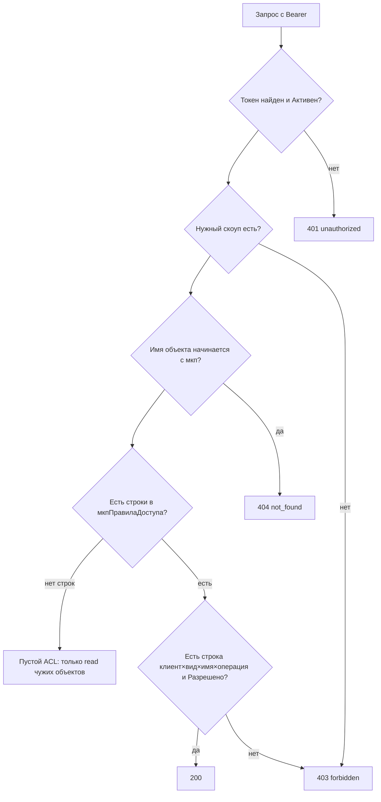

# Права: скоупы и ACL

Два уровня, оба обязательны для записи.

## Скоупы (`мкпКлиентыИнтеграции.Скоупы`)

Строка через запятую. Как изменить: карточка клиента.

| Значение | Эффект |
|---|---|
| `read` | meta, data GET, query, report, job |
| `write` | dry-run, create, patch, post, action, rollback (нужен ещё ACL) |
| `read,write` | типичный агент записи |
| `*` | любой скоуп |

Пустой ACL при скоупе `write` **не** открывает запись: нет ни одной строки правил → только `read`. Это [ADR-0006](../adr/0006-auth-lazy-meta-acl.md) и [ADR-0009](../adr/0009-write-dry-run-rollback.md).

## Регистр `мкпПравилаДоступа`

| Измерение / ресурс | Смысл | Как изменить |
|---|---|---|
| `Клиент` | ссылка на элемент клиентов интеграции | выбрать клиента |
| `ВидОбъекта` | `catalog`, `document`, `report`, … как в API | строка вида |
| `ИмяОбъекта` | имя метаданных **без** префикса `мкп` | как в `meta_describe` |
| `Операция` | `read` или `write` | |
| `Разрешено` | да / нет | нет = явный запрет |
| `Поля` | необязательный список полей (задел) | пусто = все видимые поля |

Появление **первой** строки для клиента переводит его в режим белого списка: разрешено только явно отмеченное.

Объекты расширения (`мкп*`) агенту не видны никогда: ответ `404`, не `403`.

## Роль `мкпДоступКоннектора`

Её назначают **пользователю публикации** HTTP-сервиса, не живому кладовщику. Роль минимальна: модули коннектора, справочники коннектора, HTTP-сервис. Права на прикладные `Документ.РеализацияТоваровУслуг` и т.д. должны быть у пользователя ИБ, указанного в публикации / `ПользовательИБ`.
