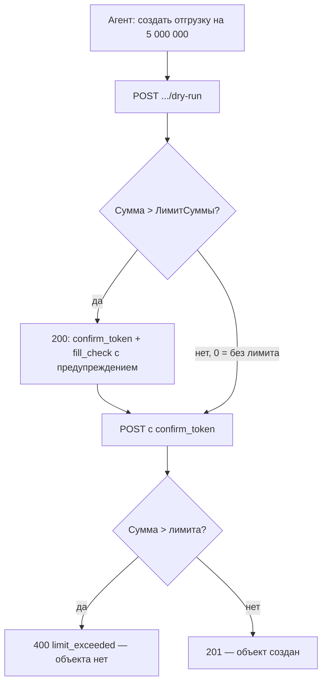

# Клиенты интеграции, токены и лимиты записи

Справочник **`мкпКлиентыИнтеграции`** — это «кто стучится в API». Один элемент = одно приложение или агент.

Лимиты **суммы** и **количества** нужны не для тарифа и не для нагрузки. Они не дают модели превратить галлюцинацию в проведённый документ на миллион.

## Реквизиты элемента

| Реквизит | Синоним | Зачем | Как изменить |
|---|---|---|---|
| Наименование | — | человеческое имя («агент продаж») | карточка элемента |
| `ХешТокена` | Хеш токена | SHA-256 plaintext-токена, **не** сам токен | только через обработку «Администрирование коннектора» (plaintext один раз) |
| `Скоупы` | Скоупы | `read`, `read,write` или `*` | строка через запятую, без пробелов предпочтительно |
| `ПользовательИБ` | Пользователь ИБ | от чьего имени считать RLS и журнал 1С | имя пользователя информационной базы |
| `Активен` | Активен | выключенный клиент → 401 | снять флажок вместо удаления |
| `ЛимитСуммы` | Лимит суммы | потолок `Amount` / `Сумма` / `СуммаДокумента` | число; **0 — без ограничения** |
| `ЛимитКоличества` | Лимит количества | потолок `Quantity` / `Количество` и строк `Товары`/`Goods`/`Items` | число; **0 — без ограничения** |

Стандартный код справочника 1С (9 знаков) задаётся платформой, на API не влияет.

## Как задать лимит суммы и количества

1. Откройте справочник **1cmcp. Клиенты интеграции** (`мкпКлиентыИнтеграции`).
2. Выберите элемент агента (не общий «на всех»).
3. Укажите **Лимит суммы**, например `100000` — документы дороже 100 000 этой интеграцией не запишутся.
4. Укажите **Лимит количества**, например `10` — сумма количеств в шапке и табличных частях не больше 10.
5. Запишите элемент. Шлюз перезапускать не нужно: проверка на слое A (и на моке).

На моке стендовый токен с жёстким лимитом: `dev-limit-token` (`max_amount=100`, `max_quantity=1`). Обычный `dev-write-token` лимитов не имеет.

!!! tip "Dry-run не блокирует HTTP 200"
    Предпросмотр **всегда** отдаёт `confirm_token`, чтобы агент увидел формулировку. Если лимит превышен, сообщения попадают в `fill_check`. Запись с этим токеном всё равно получит `400` `limit_exceeded`.

## Как выпустить токен

Обработка **`мкпАдминистрированиеКоннектора`**:

1. Укажите наименование и скоупы (`read` или `read,write`).
2. Сгенерируйте токен. **Plaintext показывается один раз.**
3. В справочник пишется только SHA-256 (`ХешТокена`).
4. Этот plaintext поставьте в `ONEC_TOKEN` шлюза или в `env` MCP. Не коммитьте в git.

Ротация: новый элемент (или новый хеш), старый **Активен = нет**, обновить `ONEC_TOKEN` у шлюза.

## Мок и живая 1С

| Контур | Токен чтения | Токен записи |
|---|---|---|
| мок / Compose | `dev-token` | `dev-write-token` |
| живая 1С | тот, чей хеш в справочнике | тот же клиент со скоупом `write` и ACL |

Подробные права: [ACL](access.md). Полный список полей расширения: [объекты расширения](../reference/extension.md).
