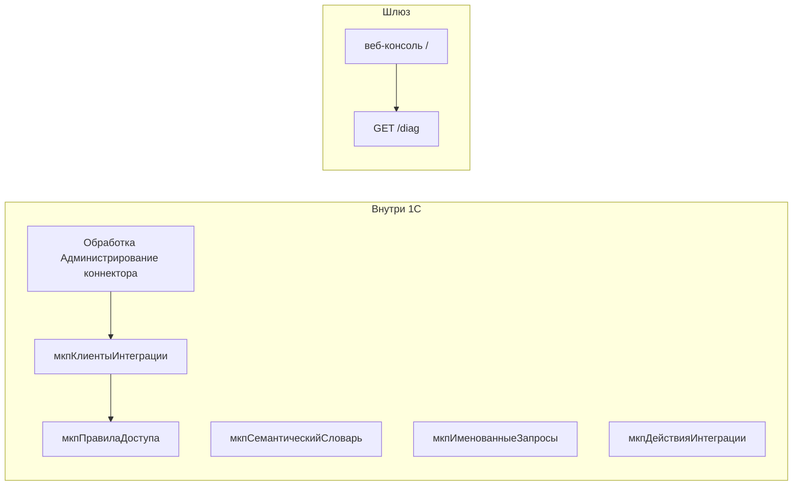

# Администрирование

Эта вкладка — для того, кто настраивает коннектор **после** установки: токены, права, лимиты агента, несколько баз, диагностика.

## С чего начать администратору

1. Выпустить токен и заполнить скоупы — [клиенты и лимиты](clients.md).
2. Если агент пишет документы — выставить **Лимит суммы** / **Лимит количества** на этом же элементе.
3. Если нужна не «вся база на чтение», а whitelist — [правила доступа](access.md).
4. Несколько информационных баз на одном шлюзе — веб-консоль → Базы 1С, подробности [тенанты](tenants.md).
5. Проверить контур без секретов в ответе — [диагностика](diag.md).
6. Что вызывал агент — `GET /v1/audit` (свой клиент) или регистр `мкпЖурналВызовов` в 1С.
7. Любая другая ручка — сначала [как что-либо изменить](how-to-change.md), затем полный [справочник настроек](../reference/settings.md).

!!! danger "Прямая публикация 1С"
    Агенты и n8n ходят в шлюз. URL вида `https://1c.company/ib/hs/mcp` не должен быть доступен из интернета.

Клиентские лицензии платформы 1С считает сеанс HTTP-сервиса, не ключ 1cmcp. Расчёт — на странице диагностики.
