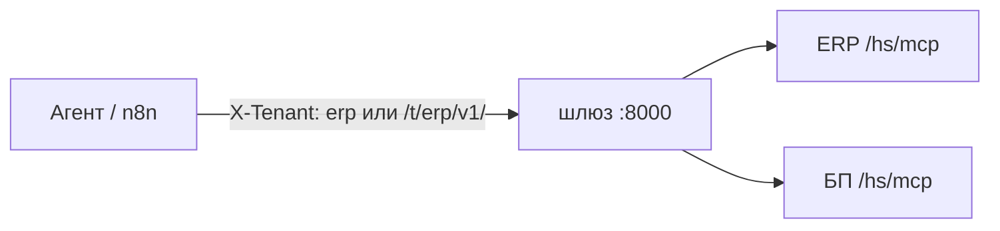

# Несколько информационных баз (тенанты)

Один процесс шлюза может ходить в несколько публикаций 1С. Контракт JSON один и тот же ([ADR-0001](../adr/0001-three-layer-architecture.md)).



## Как включить

1. Откройте веб-консоль шлюза: `http://127.0.0.1:8000` → **Администрирование**.
2. Войдите токеном `ADMIN_BOOTSTRAP_TOKEN`, заведите оператора.
3. На вкладке **Базы 1С** добавьте публикации (`id`, URL без `/v1`, plaintext токена из обработки 1С).
4. MCP-процесс читает тот же `GATEWAY_DATA_DIR`, если задан.

Env `ONEC_TENANTS` — только семя первого старта. Формат карты, если всё же задаёте семя:

```bash
ONEC_TENANTS=erp=http://erp.internal/ib/hs/mcp,bp=http://bp.internal/ib/hs/mcp
```

или JSON:

```bash
ONEC_TENANTS={"erp":"http://erp.internal/ib/hs/mcp","bp":"http://bp.internal/ib/hs/mcp"}
```

В Helm: `gateway.tenants` и `gateway.tenant`.

## Как выбрать базу в запросе

| Способ | Пример |
|---|---|
| Заголовок | `X-Tenant: bp` на `/v1/...` |
| Путь | `GET /t/bp/v1/health` |
| Умолчание | нет заголовка → `TENANT` |

Неизвестный id → `404` `unknown_tenant`. URL в карте — **корень слоя A без `/v1`**.

`GET /diag` показывает список id тенантов и **не** показывает токен.
