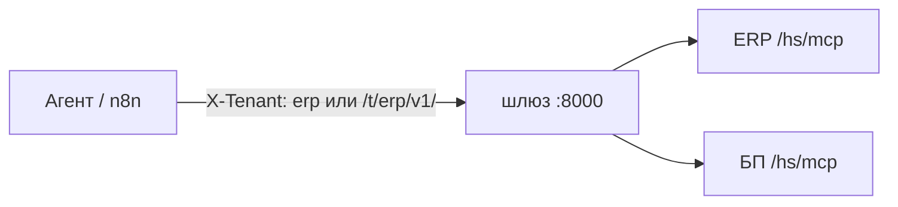

# Несколько информационных баз (тенанты)

Один процесс шлюза может ходить в несколько публикаций 1С. Контракт JSON один и тот же ([ADR-0001](../adr/0001-three-layer-architecture.md)).



## Как включить

1. Задайте тенант по умолчанию: `TENANT=erp` (уходит как `X-Tenant` на слой A).
2. Добавьте карту баз в `ONEC_TENANTS`.
3. Перезапустите `serve`. MCP-процесс по-прежнему привязан к одному `TENANT` из своего `.env`.

Формат карты:

```bash
ONEC_TENANTS=erp=http://erp.internal/ib/hs/mcp,bp=http://bp.internal/ib/hs/mcp
```

или JSON:

```bash
ONEC_TENANTS={"erp":"http://erp.internal/ib/hs/mcp","bp":"http://bp.internal/ib/hs/mcp"}
```

В Helm: `gateway.tenants` и `gateway.tenant`.

## Как выбрать базу в запросе

| Способ | Пример |
|---|---|
| Заголовок | `X-Tenant: bp` на `/v1/...` |
| Путь | `GET /t/bp/v1/health` |
| Умолчание | нет заголовка → `TENANT` |

Неизвестный id → `404` `unknown_tenant`. URL в карте — **корень слоя A без `/v1`**.

`GET /diag` показывает список id тенантов и **не** показывает токен.
