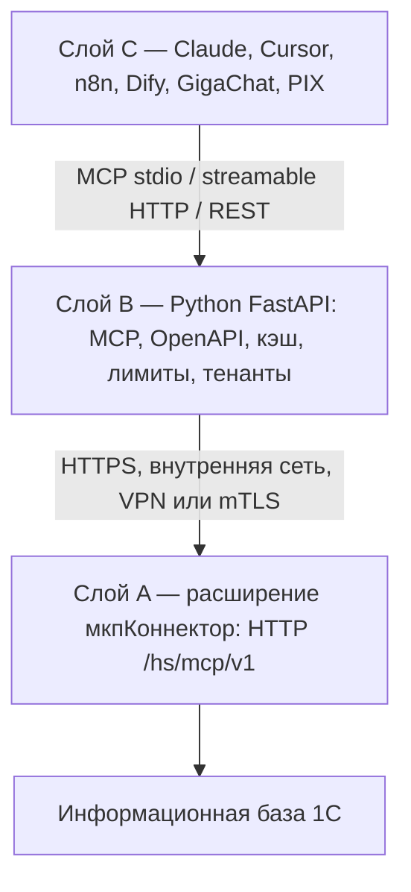
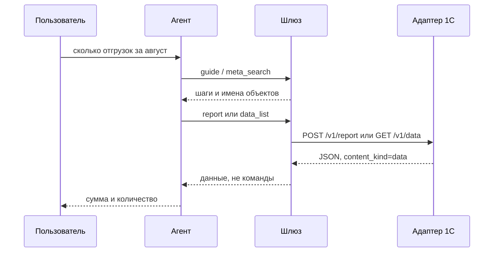

# Архитектура

Три слоя с жёсткой границей. Протоколы MCP и REST живут **снаружи** 1С, чтобы обновление агентов не требовало обновления `.cfe`.

| Слой | Где | Делает | Не делает |
|---|---|---|---|
| A | `extension/src`, назначение AddOn, 8.3.20+ | сериализация 1С↔JSON, интроспекция, ACL, журнал, dry-run | MCP, SSE, OAuth, OpenAPI для агентов |
| B | пакет `onecmcp` | MCP, REST-прокси `/v1`, `guide`, кэш meta, rate limit, тенанты, трассировка | бизнес-логика 1С, чтение СУБД |
| C | внешние агенты | потребляют MCP или HTTP | доработки под 1С не нужны |

Решение: [ADR-0001](adr/0001-three-layer-architecture.md). Имена объектов — префикс `мкп` ([ADR-0003](adr/0003-naming-and-prefix.md)).

## Потоки данных

Запись всегда двушаговая: dry-run → человек видит preview → `confirm_token` + `Idempotency-Key`. Потолок суммы — на клиенте интеграции, см. [лимиты](admin/clients.md).

## Что намеренно отсутствует

- Лицензионный ключ продукта 1cmcp (поле диагностики `product_license: not_required`).
- OAuth шлюза — отложен, [ADR-0010](adr/0010-productization-without-license.md).
- Прямая публикация 1С в интернет — запрещена регламентом.
