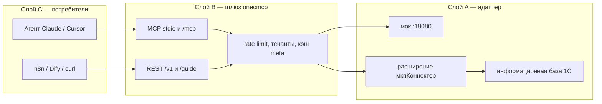

# 1cmcp — документация

Универсальный коннектор, который открывает любую конфигурацию 1С (типовую или самописную) для ИИ-агентов и внешних приложений по **MCP** и **REST**: чтение, запись, отчёты СКД и вызов разрешённой бизнес-логики.

Ключ продукта 1cmcp **не нужен**. Клиентские лицензии платформы 1С (сеансы HTTP-сервиса) — нужны, см. [диагностику и лицензии](admin/diag.md).

## Кому какая вкладка

Верхнее меню сайта — вкладки. Откройте ту, которая соответствует вашей роли.

| Вкладка | Кто | Зачем |
|---|---|---|
| **Начало** | все | что это, схема слоёв, совместимость |
| **Установка** | внедренец, DevOps | мок, расширение, публикация, шлюз, Docker, Helm |
| **Пользование** | аналитик, автор сценариев, агент | REST, MCP, чтение, запись, `guide` |
| **Администрирование** | администратор 1С | токены, **лимиты суммы и количества**, ACL, тенанты, как изменить настройку |
| **Справочник** | все | **полный список настроек** — ни одной переменной вне этой вкладки |
| **Разработка** | команда продукта | clean room, ADR, стенды |

!!! warning "1С в интернет не публикуйте"
    Снаружи виден только шлюз (`serve` или stdio MCP). HTTP-сервис `/hs/mcp` — только из внутренней сети, VPN или mTLS.

## Как устроен продукт



## Три быстрых пути

=== "Проверить шлюз без 1С"

    ```bash
    python3 -m pip install -e "gateway[dev]"
    python -m onecmcp mock1c --port 18080
    python -m onecmcp serve --port 8000
    curl -s http://127.0.0.1:8000/diag
    ```

    Пошагово: [контур без 1С](install/mock.md).

=== "Подключить агента"

    Claude Desktop — stdio: [пресеты](connect/README.md).
    Cursor по HTTP — `http://127.0.0.1:8000/mcp` после `serve`.

=== "Ограничить сумму агента"

    В справочнике `мкпКлиентыИнтеграции` заполните **Лимит суммы** и **Лимит количества**.
    Зачем и как: [клиенты, токены и лимиты](admin/clients.md).

## Открыть этот сайт локально

```bash
python3 -m pip install -r requirements-docs.txt
mkdocs serve
```

Браузер: `http://127.0.0.1:8000` у MkDocs (это **не** шлюз 1cmcp; шлюз по умолчанию тоже `:8000` — задайте другой порт: `mkdocs serve -a 127.0.0.1:8001`).

Сборка статики: `./scripts/docs.sh`.

Полнота настроек проверяется тестом: если добавили переменную в `Settings` или Helm и не описали её в [справочнике](reference/settings.md), CI падает.
