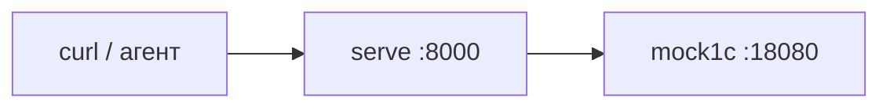

# Контур без базы 1С

Нужен, чтобы проверить шлюз, MCP и сценарии агента за минуты. Платформа 1С не требуется.

## Что поднимается



Мок повторяет контракт слоя A: health без токена, `meta`/`data` с `Authorization: Bearer dev-token`.

## Python

```bash
python3 -m venv .venv
source .venv/bin/activate
python -m pip install -e "gateway[dev]"
cp .env.example .env
```

Два терминала:

```bash
python -m onecmcp mock1c --host 127.0.0.1 --port 18080
python -m onecmcp serve --host 127.0.0.1 --port 8000
```

```bash
curl -sS http://127.0.0.1:8000/health
curl -sS http://127.0.0.1:8000/ready
curl -sS http://127.0.0.1:8000/diag
curl -sS -H "Authorization: Bearer dev-token" \
  "http://127.0.0.1:8000/v1/meta/search?q=отгрузка"
```

Без Bearer запрос к `/v1/meta` — **401**. Запись на стенде — `dev-write-token`. Фикстуры: `Catalog.DemoCounterparties`, `Document.DemoShipments`, отчёт `DemoSales`. UUID контрагента «Ромашка»: `8a996f93-36c8-4bcf-b707-f75b8b4bc5e3` (не менять в тестах).

Автотесты: `./scripts/ci.sh` (покрытие `onecmcp` ≥ 90%).

Полный текст с Windows и типичными ошибками — [обзор установки](../install.md).
