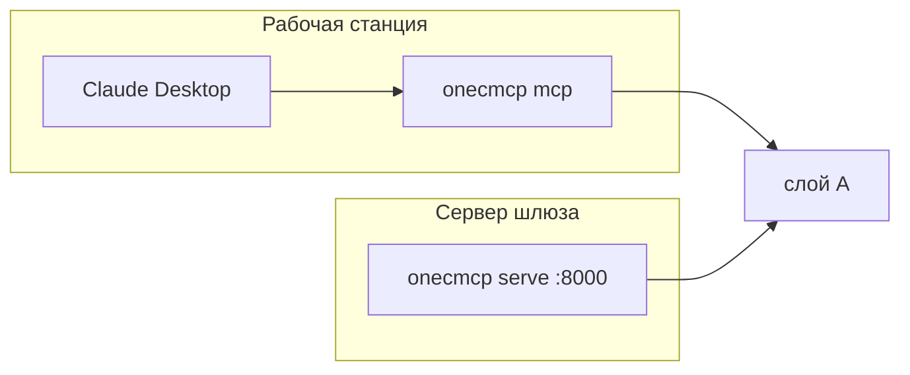

# REST и MCP

Агент видит либо процесс stdio, либо HTTP шлюза. В 1С он не ходит.



## REST

База: `http://127.0.0.1:8000`. Примеры:

```bash
export BASE=http://127.0.0.1:8000
export TOKEN=dev-token
curl -sS -H "Authorization: Bearer $TOKEN" "$BASE/v1/meta/search?q=контрагент"
curl -sS "$BASE/guide?q=продажи%20за%20август"
```

Карта путей: [HTTP и MCP](../reference/api.md). Ошибки: [коды](../reference/errors.md).

## MCP stdio

Пресет: [connect/claude-desktop.mcp.json](../connect/claude-desktop.mcp.json). Команда `python -m onecmcp mcp`, в `env` — `ONEC_BASE_URL`, `ONEC_TOKEN`, `ONEC_PRESET`.

## MCP streamable HTTP

После `serve` URL: `http://127.0.0.1:8000/mcp`. Пресет: [connect/http.mcp.json](../connect/http.mcp.json).

Отдельный процесс: `python -m onecmcp mcp --transport streamable-http`.
