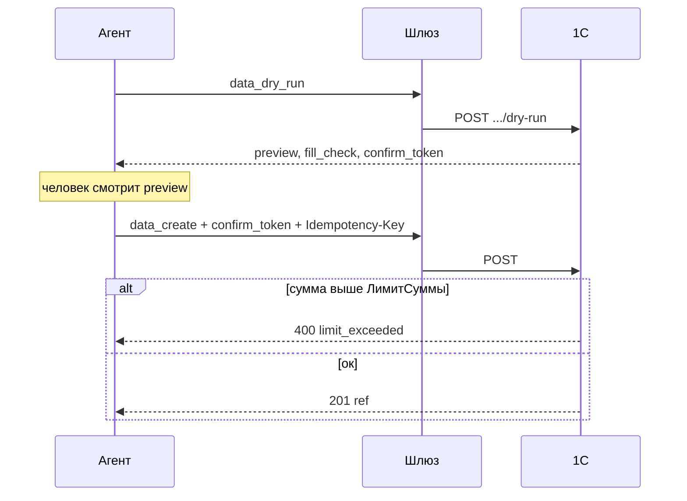

# Запись, dry-run и лимиты

Запись — самая опасная операция. Агент **не** пишет сразу.

Обязательно:

- скоуп `write` и строка ACL на объект;
- сначала dry-run;
- `Idempotency-Key` 8–128 символов (повтор с тем же телом не создаёт дубль);
- при желании `X-Session-Id` и затем `session_rollback`.

Лимиты суммы и количества задаёт администратор на **клиенте интеграции**. Зачем и как — [клиенты и лимиты](../admin/clients.md). Пользователь агента при `limit_exceeded` уменьшает документ или просит поднять лимит; сам лимит из чата не меняется.

Проведение: dry-run с `post=true`, затем `data_post`. Ошибки заполнения — `422` с текстом, что исправить.

Плейбуки записи (`primary_from_mail` и т.д.) в каталоге `GET /guide` тоже идут через `data_dry_run`.
